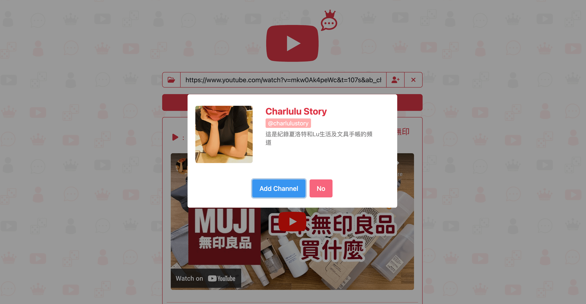
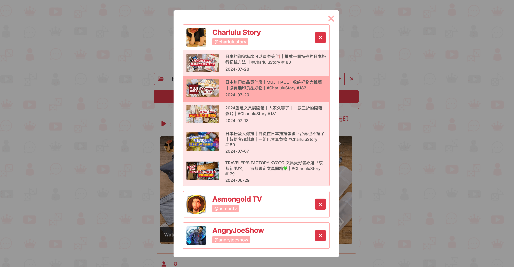
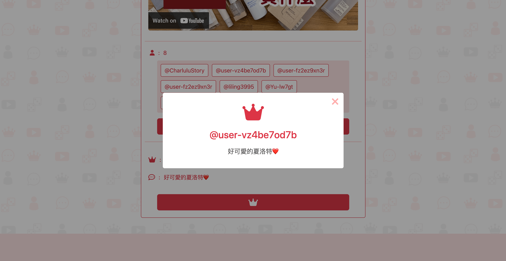

# YouTube Comment Picker

YouTube Comment Picker is a web application designed to randomly select a comment from a YouTube video. This tool is useful for giveaways, contests, or simply engaging with your audience by picking random comments from your videos.

🌐 Website : <a href="https://comment-picker-2755d12b5505.herokuapp.com/" target="_blank">https://comment-picker-2755d12b5505.herokuapp.com/</a>

## 📖 Table of Contents

1. [Screenshots](#1-screenshots-)
2. [Features](#2-features-%EF%B8%8F)
3. [Technologies](#3-technologies-)
4. [Getting Started](#4-getting-started-)
5. [Contact Me](#5-contact-me-)

## 1. Screenshots 📷








## 2. Features ⭐️

- **YouTube Integration:** Fetch comments from YouTube videos using their URLs.
- **Random Comment Picker:** Randomly select a comment from the fetched comments.
- **Responsive Design:** The application is designed to be used on both computer and mobile.
- **Channel Storage:** Allows users to store their commonly used YouTube channels.
- **Newest Videos:** Allows up to 5 newest videos to be picked from user-stored channels.

## 3. Technologies 🤓

- **Backend:** Express.js, dotenv for environment variables
- **Frontend:** HTML, CSS, JavaScript
- **API Integration:** YouTube Data API for fetching comments
- **Development Tools:** Nodemon for automatic server restart

## 4. Getting Started 🚀

### Prerequisites

- Node.js installed on your machine
- Nodemon

### Installation

1. Clone the repository:

```
git clone https://github.com/yourusername/commentpicker.git
```

2. Install NPM packages

```
npm i
```

3.  Setup your .env with youtube API key

```
YOUTUBE_API_KEY = '{API_KEY}'
```

4.  Run app ( required nodemon )

```
npm run dev
```

## 5. Contact Me 👋

If you have any questions, feedback, or suggestions, feel free to reach out:

- **Email:** [lukuoyu@gmail.com](mailto:your.email@example.com)
- **GitHub:** [klu0926](https://github.com/klu0926)
